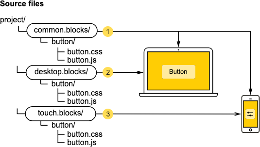

# File structure

모든 BEM 프로젝트는 파일 구조에서 유사한 구조를 따른다. 파일이 항상 익숙한 위치에 있으면 개발자가 프로젝트를 탐색하고 프로젝트 간에 쉽게 전환할 수 있다. BEM에서 [블록](https://en.bem.info/methodology/key-concepts/#block)은 일차적이고 [기술](https://en.bem.info/methodology/key-concepts/#implementation-technology)은 이차적이다.

BEM 방법론에는 프로젝트의 파일 시스템을 구성하는 몇 가지 접근법이 있다.

## [Nested](https://en.bem.info/methodology/filestructure/#nested)

BEM 프로젝트의 일반적인 파일 구조 접근방식:

- 각 블록은 단일 디렉토리에 해당한다.
- 모디파이어와 엘리먼트 코드는 별도의 파일에 저장한다.
- 모디파이어와 엘리먼트 파일은 별도의 디렉토리에 저장한다.
- 블록 디렉토리는 모디파이어와 엘리먼트 하위 디렉토리에 대한 루트 디렉토리이다.
- 엘리먼트 디렉토리의 이름은 이중 밑줄(`__`) 로 시작한다.
- 모디파이어 디렉토리의 이름은 이중 대시(`--`) 로 시작한다.

Example:

```bash
project 
    common.blocks/                            # Redefinition level with blocks 
        input/                                # Directory for the input block 
            _type/                            # Directory for the input_type modifier 
                input--type--search.css       # CSS implementation of the input--type modifier 
            __clear/                          # Directory for the input__clear element 
                _visible/                     # Directory for the input__clear_visible modifier 
                    input__clear--visible.css # CSS implementation of the input__clear--visible modifier 
                input__clear.css              # CSS implementation of the input__clear element
                input__clear.js               # JavaScript implementation of the input__clear element 
        input.css                             # CSS implementation of the input block 
        input.js                              # JavaScript implementation of the input block
```

The `nested` approach is used in the file structure of BEM libraries:

- [bem-core](https://github.com/bem/bem-core/tree/v4.2.1/common.blocks/page)
- [bem-components](https://github.com/bem/bem-components/tree/v6.0.0/common.blocks/button)

## [Flat](https://en.bem.info/methodology/filestructure/#flat)

파일 구조를 위한 단순화된 구조:

- 디렉터리는 블록에 사용되지 않는다.
- 옵셔널 엘리먼트와 모디파이어는 별도의 파일이나 주 블록 파일에 구현한다.

Example

```bash
project 
    common.blocks/ 
        input--type--search.css   # The input--type--search modifier in CSS 
        input--type--search.js    # The input--type--search modifier in JavaScript 
        input__clear.js           # Optional element of the input block 
        input.css 
        input.js 
        popup.css 
        popup.js 
        popup.png
```

## [Flex](https://en.bem.info/methodology/filestructure/#flex)

가장 유연한 접근방식은 Flat과 Nested의 조합이다. 분기된 파일 구조를 가진 블록은 `nested` 접근법을 사용했다. 단순한 블록은 `flat` 접근법을 사용한다.

어떻게 동작하는가:

- 각 블록은 별도의 디렉토리에 해당한다.
- 엘리먼트와 모디파이어는 블록 파일에 구현하거나 별도 파일로 구현할 수 있다.

Example

```bash
project 
    common.blocks/
        input/                                # Directory for the input block 
            _type/                            # Directory for the input_type modifier 
                input--type--search.css       # CSS implementation of the input--type modifier 
            __clear/                          # Directory for the input__clear element 
                _visible/                     # Directory for the input__clear--visible modifier 
                    input__clear--visible.css # CSS implementation of the input__clear--visible modifier 
                input__clear.css              # CSS implementation of the input__clear element 
                input__clear.js               # JavaScript implementation of the input__clear element 
            input.css                         # CSS implementation of the input block 
            input.js                          # JavaScript implementation of the input block 
        popup/                                # Directory for the popup block 
            popup.css 
            popup.js 
            popup.png
```

# BEM 프로젝트의 파일 구조에 대한 지침

## 프로젝트는 재정의 레벨로 구성됨

프로젝트는 항상 최소 한 개의 재정화 수준을 가지고 있다. 레벨의 최대 개수에 제한이 없다.

Example

```bash
project/
    common.blocks/  # Redefinition level with the project blocks 
    library.blocks/ # Redefinition level with the library blocks
```

## 블록 구현은 별도의 파일로 구성됨

구현 기술마다 별도의 파일이 있다. 구현 파일의 이름이 블록 이름과 일치한다.

예를 들어, `input` 블록의 외관이 CSS를 사용하여 정의된 경우, 코드는 `input.css` 파일에 저장된다.

Example

```bash
project 
    common.blocks/ 
        input.css   # CSS implementation of the input block 
        input.js    # JavaScript implementation of the input block
```

모디파이어와 엘리먼트의 코드도 블록의 별도 파일에 저장된다. 이 접근방식은 블록의 이 구현에 필요한 수식어와 요소만 포함할 수 있도록 한다.

Example

```bash
project 
    common.blocks/ 
        input.css            # CSS implementation of the input block 
        input.js             # JavaScript implementation of the input block 
        input_theme_sun.css  # Implementation of the input_theme_sun modifier 
        input__clear.css     # CSS implementation of the input__clear element 
        input__clear.js      # JavaScript implementation of the input__clear element
```

## 유형이 아닌 의미별로 파일을 그룹핑함

각 블록은 이를 구현하기 위한 파일이 들어 있는 블록 이름의 디렉토리가 있다.

일부 접근 방식에서는 블록 디렉토리가 사용되지 않는다. 이 경우 블록 파일은 블록 이름으로 설정된 네임스페이스를 사용하여 그룹화된다.

Example

```bash
project 
    common.blocks/ 
        input/            # Directory for the input block 
            input.css     # CSS implementation of the input block 
            inpudddt.js      # JavaScript implementation of the input block 
        popup/            # Directory for the popup block 
            popup.css     # CSS implementation of the popup block 
            popup.js      # JavaScript implementation of the popup block
```

프로젝트 전반에 걸친 파일 탐색을 개선하기 위해 여러 값을 가진 블록 수식어를 별도의 디렉토리에 결합할 수도 있다.

Example

```bash
project 
    common.blocks/                      # Redefinition level with blocks 
        input/                          # Directory for the input block 
            _type/                      # Directory for the input_type modifier 
                input--type--search.css # CSS implementation of the input--type modifier 
                input--type--pass.css   # CSS implementation of the input--type modifier 
            input.css                   # CSS implementation of the input block 
            input.js                    # JavaScript implementation of the input block 
        popup/                          # Directory for the popup block
```

# 재정의 레벨

## 재정의 레벨이란 무엇인가?

재정의 레벨은 블록, 엘리먼트 및 모디파이어를 구현하기 위한 파일이 들어 있는 BEM 프로젝트의 디렉토리다.

모든 BEM 프로젝트는 재정의 레벨로 구성된다. 모든 프로젝트에는 적어도 한 단계 이상의 레벨이 있어야 하지만, 레벨의 최대 개수는 무제한이다.

단일 재정의 레벨을 사용하는 BEM 프로젝트의 파일 시스템 예:

```bash
project/ 
    common.blocks/ # redefinition level with project blocks 
        header/ 
        footer/
```

규칙 재정의를 통해 다음을 수행할 수 있습니다.

### **프로젝트를 플랫폼별로 나눈다**

여러 플랫폼 (예: 모바일, 데스크톱)을 지원하는 프로젝트에서 코드의 일부는 전체 기능을 정의하고 일부는 각 플랫폼에 한정된다. 각 플랫폼 구현에 전체적으로 공유된 코드가 복사되지 않도록 재정의 레벨을 사용할 수 있다.

모든 플랫폼에 사용되는 블록의 일반적인 구현은 `common.blocks` 와 같이 동일한 레벨에 위치하며, 장치별 구현 레벨이 다른 경우 아래와 같다:

- `common.blocks` - 모든 플랫폼에서 공유하는 블록 구현
- `desktop.blocks` - 데스크톱 장치에 한정된 블록 구현
- `mobile.blocks` - 모바일 장치에 한정된 블록 구현

서로 다른 플랫폼을 지원하기 위한 파일 시스템의 예:

```bash
project/ 
    common.blocks/ 
        button/ 
            button.css   # basic CSS button implementation 
    desktop.blocks/ 
        button/ 
            button.css   # custom button for desktop 
    mobile.blocks/ 
        button/ 
            button.css   # custom button for mobile
```

빌드 결과, `desktop.bundles/bundle/bundle.css` 파일은 `common.blocks` 레벨에서 버튼에 대한 기본적인 CSS 규칙을 가져오고 `desktop.blocks` 레벨에서 재정의된 규칙을 가져오게 된다.

```css
@import "common.blocks/button/button.css";   /* Basic CSS rules */
@import "desktop.blocks/button/button.css";  /* Desktop version */
```

`mobile.bundles/bundle/bundle.css` 파일은 `common.blocks` 레벨에서 버튼에 대한 기본적인 CSS 규칙을 가져오고 `mobile.blocks` 레벨에서 재정의된 규칙을 가져온다.

```css
@import "common.blocks/button/button.css";   /* Basic CSS rules */
@import "mobile.blocks/button/button.css";   /* Mobile version */
```

코드를 별도의 재정의 레벨로 나누면 동시에 동일한 프로젝트를 서로 다른 플랫폼별로 빌드할 수 있기 때문에, 유저 에이전트를 기반으로 올바른 버전의 디자인을 제공할 수 있다.

### **프로젝트에 통합된 블록 라이브러리를 쉽게 업데이트한다. (블록에 연결된 라이브러리 업데이트)**

라이브러리에서 블록을 재정의하거나 별도 수준으로 확장하면 라이브러리가 업데이트된 경우에도 프로젝트에 대한 변경 사항을 유지할 수 있다.

이 예에서 라이브러리는 `library.blocks` 재정의 레벨에서 프로젝트로 통합된다.

```bash
project/ 
    common.blocks/   # redefinition level with project blocks 
        header/ 
        logo/ 
    library.blocks/  # redefinition level with library blocks 
        button/
```

프로젝트에 라이브러리의 버튼을 가져와 사용할 경우(`button` 블럭), 버튼의 높이를 18px에서 24px로 변경해야 한다 가정해보자. 이 를 위해, `button` 블록을 프로젝트 레벨에서 재정의한다:

```bash
project/ 
    common.blocks/      # redefinition level with project blocks 
        button/ 
            button.css  # redefined rules for the button 
        header/ 
        logo/ 
    library.blocks/     # redefinition level with library blocks 
        button/         # button implementation in the library
```

라이브러리가 업데이트되면 서로 다른 레벨에 있기 때문에, 재정의된 속성이 원래 블록 구현에 영향을 주지 않고 `button` 블록을 재정의한 내용도 그대로 유지된다.

### **서로 다른 프로젝트를 개발하기 위해 공통 블록을 사용할 수 있다 (공통 블록으로 프로젝트를 개발한다)**

여러 프로젝트에 사용되는 블록은 빌드하는 동안 별도 레벨로 이동하여 추가할 수 있다.

아래 예제는 두 프로젝트간에 공유되는 `common.block` 이 별도의 레벨로 분리되는 파일 시스템을 보여준다.

```bash
projects/ 
    common.blocks/    # shared blocks for multiple projects 
        button/ 
        input/ 
    project-1/        # project 1 
        button/       # redefined button block for project 1 
        logo/ 
        modal/ 
    project-2/        # project 2 
        button/       # redefined b1 block for project 2 
        search/ 
        spin/
```

### **프로젝트 논리에 영향을 주지 않고 디자인 테마를 변경한다 (디자인 테마 생성)**

코드의 로직과 레이아웃은 별도의 재정의 레벨로 구분할 수 있다. 이는 프로젝트의 동작에 영향을 주지 않고 서로 다른 버전의 디자인을 만들고 프로젝트의 테마 전환과 스타일 결합을 가능하게 한다.

이 예제는 서로 다른 디자인 테마가 별도의 분리 레벨에서 구현되는것을 보여준다. 프로젝트의 시각적인 형태를 변경하기 위해 빌드에 원하는 수준(desired level)을 추가하면 된다.

```bash
project/ 
    common.blocks/    # shared blocks for describing the project's business logic 
        button/ 
        input/ 
        ... 
    alpha/            # alpha design theme 
        button/ 
        input/ 
    beta/             # beta design theme 
        button/ 
        input/
```

### 상용중인 **프로젝트에서 실험을 수행한다**

재정의 레벨을 사용하면 상용중인 프로젝트에 A/B 테스트를 수행할 수 있다. 각 실험은 별도의 재정의 레벨에 있기 때문에 실험 중에는 상용 프로젝트의 코드가 변경되지 않는다

블록의 스타일, 동작 또는 페이지 마크업을 변경하여 실험을 실행할 수 있다. 예를들어, 사이트 접근성(a11y) 을 보장하려면 페이지에 새 태그를 추가하는 실험을 수행해야 한다. 이렇게 하기 위해 실험 레벨에서 템플릿과 JavaScript 코드를 다시 정의한다.

프로젝트에서 실패한 실험을 제거하려면, 재정의 레벨이 포함된 디렉토리만 삭제하면 된다.

아래 예제는 상용중인 프로젝트에서 파일 시스템에 여러 실험을 추가하는 방법을 보여준다:

- 사용자의 프로필 사진을 변경한다 (`user-pic` 블록)
- 헤더 오프셋을 변경한다 (`header` 블록)
- 사용자 이름의 폰트를 변경한다 (`user-name` 블록)

```bash
project/ 
    common.blocks/    # project blocks 
        header/ 
        user-name/ 
        user-pic/ 
        ... 
exps/ 
    exp-1/            # level for experiment 1 
        header/       # new offsets in the header 
        user-name/    # new font for the user name 
        user-pic/     # new type of profile picture 
    exp-2/            # level for experiment 2 
        header/       # new offsets in the header 
        user-name/    # new font for the user name 
        user-pic/     # new type of profile picture 
    exp-n/            # level for any new experiment 
        header/       # new offsets in the header 
        user-name/    # new font for the user name 
        user-pic/     # new type of profile picture
```

## 재정의 레벨은 무엇 때문에 사용하는가?

재정의 레벨은 아래의 목적으로 사용한다

### **프로젝트에 새 블럭을 추가할 때**

변경 없이 프로젝트의 모든 레벨에서 블록을 사용할 수 있다.

아래 예제는 프로젝트에서 타사 라이브러리의 버튼을 사용하는 방법을 보여준다. 분리 레벨에서 라이브러리를 `button` 블록에 연결 해주면 된다. `button` 블록의 코드를 복사해 프로젝트 블록 수준으로 사용할 필요가 없다.

연결된 라이브러리 수준의 프로젝트 파일 시스템은 다음과 같다:

```bash
project/ 
    common.blocks/  # redefinition level with project blocks 
        header/ 
        logo/ 
    library.blocks/ # redefinition level with library blocks 
        button/     # button block
```

프로젝트를 빌드한 결과, `button` 블록이 프로젝트에 포함된다

```bash
@import "common.blocks/header/header.css";  /* header from the common project block level */
@import "common.blocks/logo/logo.css";      /* logo from the common project block level */
@import "library.blocks/button/button.css"; /* button from the library level */
```

### **기존에 존재하는 블럭을 변경할 때**

다른 재정의 레벨에서 프로젝트의 요구를 충족하기 위해 모든 레벨의 블록을 수정할 수 있다:

- Extend - 블록에 신규 속성 추가
- Redefine - 블록에 존재하는 속성 변경

중요한 BEM 프로젝트에서는 모든 블록 구현 기술을 확장하거나 재정의할 수 있다. 더 자세한 정보는 [플랫폼](https://en.bem.info/technologies/classic/bem-xjst/8/runtime/)을 확인?

최종 블록 구현을 조립하기 위해 원하는 수의 레벨을 사용할 수 있다. 원래 블록 구현은 후속 레벨의 구현에 의해 확장되거나 재정의된다. 따라서 원래 구현을 먼저 빌드에 포함시킨 다음 모든 재정의 레벨에서 변경 사항을 적용할 수 있어야한다.

중요! 블록을 확장하거나 재정의할 때 블록이 원래 구현된 모양은 변경되지 않는다.

아래 다이어그램은서로 다른 재정의 레벨의 BEM 엔티티를 빌드에 추가하는 방법을 보여준다:


 아래 예제는 프로젝트에 연결된 타사 라이브러리에서 `button` 블록을 별도의 수준으로 변경하는 방법을 보여준다 (`library.blocks`):

```bash
project/ 
    common.blocks/  # redefinition level with project blocks 
        header/ 
        logo/ 
    library.blocks/ # redefinition level with library blocks 
        button/     # button block
```

`button` 블록의 오리지널 CSS 구현모습:

```css
/* The button block in CSS on the library.blocks level*/ 

.button { 
    position: absolute; 
    border: 1px solid rgba(0,0,0,.2); 
    border-radius: 3px; 
    background-color: #fff;
}
```

렌더링된 결과:


모양을 변경하기 위해 해야할 것:

- 블록 재정의 - 색상과 버튼 사이즈 변경
- 블록 확장 - 버튼에 그림자 추가

이렇게 하려면, `common.blocks` 에 `button`블록을 만들고 `button.css` 파일을 새로운 버튼 스타일로 추가한다.

`common.blocks`에 `button` 블록을 추가한 프로젝트의 파일 시스템:

```bash
project/ 
    common.blocks/     # redefinition level with project blocks 
        header/ 
        logo/ 
        button/ 
            button.css # new rules for the button block 
    library.blocks/    # redefinition level with library blocks 
        button/        # the button block 
            button.css 
            button.js
```

New CSS 규칙:

```css
/* The button block in CSS on the common.blocks level */

.button {
    background-color: #ffdf3a;            /* New button color */
    width: 150px;                         /* Button width */
    box-shadow: 0 0 10px rgba(0,0,0,0.5); /* Shadow parameters */
}
```

빌드가 완료된 후, `button` 블럭의 구현은 `library.blocks` 레벨의 원본 CSS 규칙과 `common.blocks` 레벨의 추가적인 규칙으로 이루어지게 된다.

```css
@import "library.blocks/button/button.css";  /* Original CSS rules from the library level */
@import "common.blocks/button/button.css";   /* Properties from the common.blocks level*/
```

복제된 속성(`background-color` )은 재정의(배경 색상이 노랑으로 변경된다) 되고, 새 속성(`width` 와 `box-shadow` )은 추가된다. 아래의 속성들은 `button` 블록에 적용된다:

```css
.button {
    position: absolute;
    border: 1px solid rgba(0,0,0,.2);
    border-radius: 3px;
    background-color: #ffdf3a;             /* New button color */
    width: 150px;                          /* Button width */
    box-shadow: 0 0 10px rgba(0,0,0,0.5);  /* Shadow parameters */
}
```

새 버튼의 외양은 아래와 같다.


결론:

- `button` 블록의 원본 구현은 변경되지 않는다.
- 프로젝트 레벨에서 변경되는 `button` 블럭은 프로젝트 내 모든 버튼에 적용된다.
- 라이브러리를 최신 버전으로 업그레이드하면, 프로젝트를 위해 변경한 내용은 다른 재정의 레벨에 저장된다. 새 버전 라이브러리가 기존 버튼 배경과 사이즈를 가지는 경우에도 재정의된 규칙은 여전히 프로젝트 내 `button` 블록에 적용될 것이다.

## 재정의 레벨은 어떻게 사용하는가

동일한 프로젝트에서 서로 다른 빌드를 구성할 수 있다: 각 개별 케이스에 대한 레벨의 순서 및 수를 정의한다. 예를들어, 프로젝트의 각 페이지에 사용할 레벨 집합을 개별적으로 구성할 수 있다.

이 예제에서는 [재정의 레벨을 사용하여 프로젝트를 플랫폼별로 분할](https://en.bem.info/methodology/redefinition-levels/#dividing-a-project-into-platforms)하는 방법을 보여 준다.

유저 에이전트에 따라 프로젝트가 서로 다른 플랫폼으로 빌드되는 상황을 보여주는 이미지이다.



## 재정의 레벨 사용 예제

재정의 레벨 / 1. 재정의 레벨이란 무엇인가? 의 리스트 참조