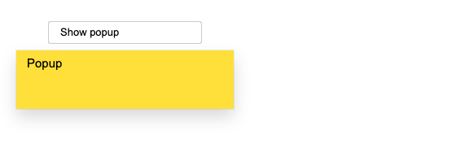
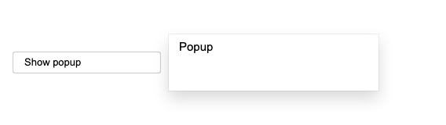
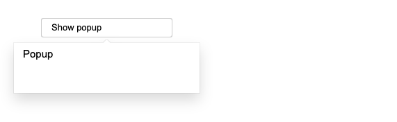
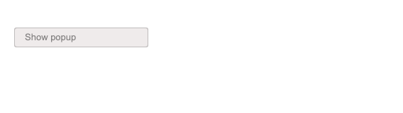
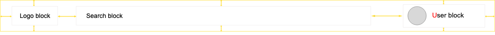

# Block 수정 방법

## Modifier 사용

~~~
독립적이고, 재사용이 가능한 페이지 컴포넌트인 block !
다른 페이지에서도 이 하나의 block은 언제든지 재사용이 가능합니다. 
때문에 페이지 별로, 상태 별로 block을 구분하기 위해 다음과 같은 방법으로 수정 할 수 있답니다.
~~~

modifier를 사용해서 block 변경하는 방법

하나의 block에서 테마 / 위치 / 구조 / 상태 등이 변경되어야 하는 경우를 안내 합니다.

### appearence(외관, 테마)

- theme modifier를 사용해서 block의 색상을 적용한다.

  

    ```jsx
    <!-- Popup with the "theme" modifier set to "sun"--> 
    <div class="popup popup_theme_sun"> ...</div>
    ```

### behavior(위치)

- direction modifier를 사용해서 block의 위치를 적용한다.

    

    ```jsx
    <!-- Popup block --> 
    <div class="popup popup_direction_right"> ...</div>
    ```

### structure (구조)

- true 값을 가진 has-tail modifier를 사용해서 popup의 말풍선 꼬리를 적용한다.

    

    ```jsx
    <!-- Popup block --> 
    <div class="popup popup_has-tail"> ...</div>
    ```

### state (상태)

- disabled modifer를 사용해서 비활성화 상태를 적용한다.

    

    ```jsx
    <!-- The "button" block with the "disabled" modifier --> 
    <div class="button button_disabled"> ...</div>
    ```

### multiple modifier (두 개 이상의 modifier)

- block에 다양한 modifier를 적용할 수 있다.
    - 예) sun 테마 적용 + has-tail을 적용

    

    ```jsx
    <!-- Popup block --> 
    <div class="popup popup_theme_sun popup_has-tail"> ...</div>
    ```

## Mixes

하위 block이 상위 block의 영향을 받는 경우 / 각각 다른 block이지만 공통되는 CSS 코드가 있는 경우 등 

여러 개의 block을 어떻게 관리할 지에 대해 안내합니다.

### 상위 block과 하위 block의 관계

- block 내에 여러 개의 block이 존재할 수 있고, 각각의 block은 독립적이고, 재사용이 가능합니다.
- 상위 block의 영향을 받는 하위 block의 경우,

    상위 block의 block-name에 __element-name을 하위 block에 추가해서 스타일을 줍니다.

- (예시)

    

    - 현재 header는 자신 안에 중첩된 각각의 block의 위치를 알 수 없다.
    - header 안의 각각 logo, search, user block들을 header에 추가하기 위해 각각의 block들의 위치가 정의되어야 한다.
        - 그리고 header, logo, search, user 각각의 block은 반드시 독립적으로 있어야 한다.
    - 위와 같은 이유로, header 내에 중첩된 각각의 block은 상위 header block와 연결되는 element(요소)를 추가해서 위치나, 오프셋을 설정해야 한다!
    - 아래와 같이, 중첩된 logo, search, user block의 스타일은 변경되지 않고, 여전히 오프셋에 포함되지 않는다. 이 block들은 여전이 독립적이고 어디에서든 재사용이 가능하다.

    ```jsx
    <!-- "header" block --> 
    <header class="header"> 
        <div class="logo header__logo"> ...</div> 
        <div class="search header__search"> ...</div> 
        <div class="user header__user"> ...</div> 
    </header>
    ```

### 공통 스타일 그룹화

- 여러 HTML 요소에서 스타일을 일관되게 유지하는 데 사용됩니다.
- 각각 다르게 사용 되는 block이지만 그 안에 공통으로 사용하는 스타일이 있다면,

    공통으로 사용할 수 있는 block을 추가해서 스타일을 줍니다.

- (예시)
    - article, copyright block에 들어갈 텍스트는 동일한 컬러와 폰트가 사용 되어야 한다.
    - 이를 위해서는 각각의 article / copyright block과 동시에 텍스트의 font와 color를 정의하는 text block을 사용할 수 있다.

    ```jsx
    // HTML
    <article class="article text"> ...</article> 
    <footer class="footer"> 
        <div class="copyright text"> ...</div> 
    </footer>

    // CSS
    .text {
        font-family: Arial, sans-serif;
        font-size: 14px;
        color: #000;
    }
    ```

## Redefinition levels

디폴트로 정의한 디렉토리에, 아예 새롭게 재정의한 디렉토리를 결합 해주는 방법입니다.

- *재정의 하는 목적*
    - 기존의 block들과 다른, 완전히 새로운 기능의  block을 추가하는 경우
        - 새로운 디렉토리에 새롭게 추가될  block을 추가해서 연결해주는 방법이다.
        - import를 사용하기 때문에, 추가된 block을 기존 파일에 복사해서 넣어 주지 않아도 된다.

        ```jsx
        project/ 
            common.blocks/  # redefinition level with project blocks 
                header/ 
                logo/ 
            library.blocks/ # redefinition level with library blocks 
                button/     # button block

        @import "common.blocks/header/header.css";  /* header from the common project block level */
        @import "common.blocks/logo/logo.css";      /* logo from the common project block level */
        @import "library.blocks/button/button.css"; /* button from the library level */
        ```

    - 기존의 block에서 다른 UI를 추가하거나, 변경하는 경우

        확장 → 기존 block에 새 속성을 추가할 때
        재정의 → 기존 block의 속성을 변경할 때

        - BEM 프로젝트에서는 모든 Block은 확장하거나 재정의 할 수 있다.
        - 디폴트로 정의한 파일은 확장 / 재정의된 파일에 따라 오버라이딩 되기 때문에, 디퐅트로 정의한 파일은 가장 먼저 선언 되어야 하고, 그 다음에 확장 / 재정의된 파일을 선언 해주어야 한다 !
        - 그리고 디폴트로 정의한 파일은 확장 / 재정의된 내용에 직접적인 영향을 받으면 안된다!
        - (예시)
            - 라이브러리와 같은 글로벌 block은 프로젝트의 목적, 방향성에 따라 다르게 보여야 한다.
            - 때문에 이 글로벌 block을 별도의 재정의한 디렉토리 파일에 연결하면 된다.
            - 디폴트 library block의 컬러를 바꾸기 위해, 새롭게 재정의한 project block이 있다.

            ```jsx
            project/ 
                library.blocks/ 
                    button/ 
                        button.css  # original CSS implementation of the button in the library 
                project.blocks/ 
                    button/ 
                        button.css  # redefinition on the project level

            @import "library.blocks/button/button.css"; /* Original CSS rules from the library level */
            @import "project.blocks/button/button.css"; /* Properties from the project.blocks level */
            ```

## Context

수정이 필요한 block의 상위 block을 사용해서 스타일을 수정하는 방법입니다.

mixes를 사용할 수 없는 경우에만 context를 사용해서 모양이나 동작을 변경해야 합니다.

context 방법을 자주 사용하면 block의 독립성이 제한되어 좋지 않습니다.

- (예시)
    - 사용자가 적용 할 수 있는 기본 태그에 대한 규칙을 미리 정의 할 수 있습니다.

    ```jsx
    .comments p {
        font-family: Arial, sans-serif;
        text-align: center; 
    }
    ```