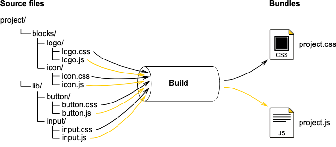
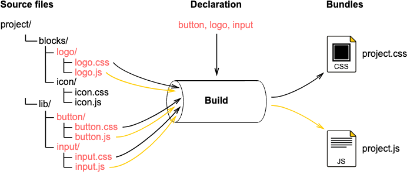
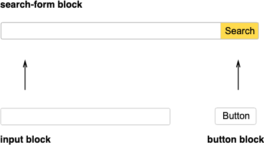

# BEM 프로젝트 구성하기

## 소개

BEM 방법론에 따른 코드는 여러 개의 파일들로 분리되어 있습니다.
이 분리된 파일들을 하나의 소스 파일로 합쳐 주기 위해서 빌드 프로세스를 따릅니다.
이 결과물 파일은 번들이라고 부르겠습니다.



### 빌드를 할 경우, 아래와 같은 업무를 수행합니다.

- 파일 시스템에 분산된 소스 파일들을 결합해서 빌드합니다.
- 프로젝트에서 필수적으로 사용되는 block, element, modifier만 포함합니다.
- 정의한 BEM 단위들이 임포트 된 순서로 처리합니다.
- 빌드하는 동시에 소스 코드를 처리합니다.
    - 예를 들어 SCSS 를 CSS로 컴파일 하는 것

## 빌드 단계

빌드의 결과물인 번들 파일을 생성하기 위해서, 다음을 정의합니다.

### 1. BEM 단위들 목록 생성



- 빌드하는데에 필수적으로 사용 되는 BEM 단위들만 사용하기 위해서, 페이지에서 사용 되는 block / element / modifier 의 목록을 만들어야 한다.
    - (scss의 import와 비슷한 개념으로 보여집니다)
- 이 목록을 "선언" 이라고 한다.
    - 빌드를 하는 과정에서 번들되는 파일의 용량을 증가시키는 불필요한 코드를 제거해준다.
- 빌드 툴은 리스트에서 선언된 BEM 단위들만 번들한다!

### 2. BEM 단위들의 새로운 정의 (종속, 재정의)



- BEM 방법론상, 다른 block 안에 새로운 block을 만들 수 있다.
- 이런 중첩되는 것들을 고려했을 때,  어느 상위 block에 속되어 있음을 뜻하는 새로운 정의해야 할 필요가 있다.
- 종속이란 것은 불필요한 복사와 붙여넣기를 방지할 수 있다.
    - (종속 = 상위의 block의 영향을 받는 것)
- 빌드 도구는 종속에 대한 정보를 얻고 블록 구현에 필요한 모든 BEM 단위들을 추가한다.

### 빌드에 BEM 단위들을 임포트 하는 순서

빌드에 BEM 단위들을 포함하는 순서는 다음에 따라 다릅니다.
- 종속 (상위의 block의 영향을 받는 하위 block)
- 재정의 레벨

- **종속과 빌드에 BEM 단위들을 포함하는 순서**
    - BEM 방법론상, 종속은 빌드에 BEM을 포함하는 순서에 영향을 줄 수 있다.
    - BEM 단위들을 포함하는 메커니즘은 다양한 방식으로 포함 우선 순위의 영향을 미치는 DEPS 실체에 의존을 한다. (?)
- **재정의 레벨과 BEM 단위들을 포함하는 순서**
    - 최종 block 구현은 서로 다른 재정의 레벨을 거쳐서 분산될 수 있다.
    - 재정의 레벨은 각각 다양한 플랫폼에서 맞는 block의 표현과 동작을 변경할 수 있다.
    - 각각의 최종 block은 디폴트 block을 확장하거나 오버라이드 한다.
    - 그러므로 맨 처음 포함 시켜야 하는건 디폴트 block이고, 그러고 나면 모든 재정의 레벨이 적용되고 그에 맞게 바뀌게 된다.

## 빌드 결과

다음과 같이 빌드한 결과물 파일이 나옵니다

- 공통으로 사용되는 CSS
    - header.css

        OR

    - footer.css
- 페이지 별 사용되는 CSS
    - hello.css

        AND

    - hello.js
- 총 프로젝트 사용되는 CSS
    - project.css

        AND

    - project.js

### 설명

- 싱글 페이지, 혹은 프로젝트가 빌드될 때 결과 코드는 다음을 포함합니다.
    - 해당 프로젝트의 구조에 포함된 모든 BEM 단위들
        - 코드 용량이 상당히 크다.
    - 정말 필요한 BEM 단위들
    - (예시)
    - 빌드 전 코드

        ```jsx
        blocks/                 # Directory containing blocks

        bundles/                # Directory containing build results (optional)
            hello/              # Directory of the hello page (created manually)
                hello.decl.js   # List of BEM entities requires for the hello page
        ```

    - 빌드 후 코드

        ```jsx
        blocks/

        bundles/
            hello/
                hello.decl.js
                hello.css       # Compiled CSS file for the hello page (the hello bundle in CSS)
                hello.js        # Compiled JS file for the hello page (the hello bundle in JS)
        ```

## 빌드 툴

- [ENB](https://en.bem.info/toolbox/enb/)
- [Gulp](https://gulpjs.com/)
- Webpack