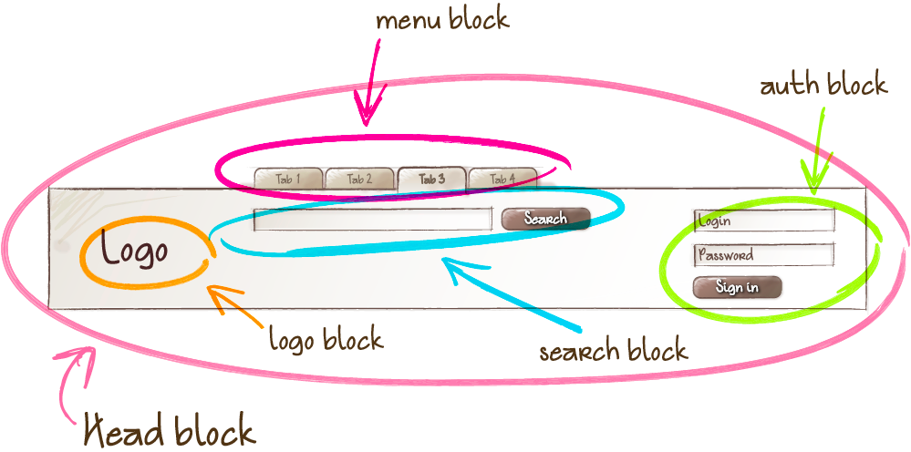
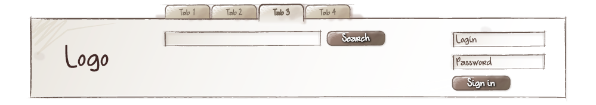
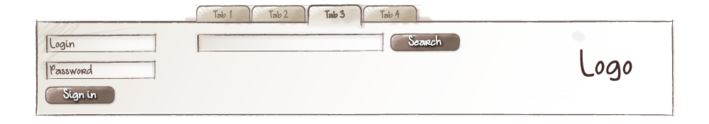
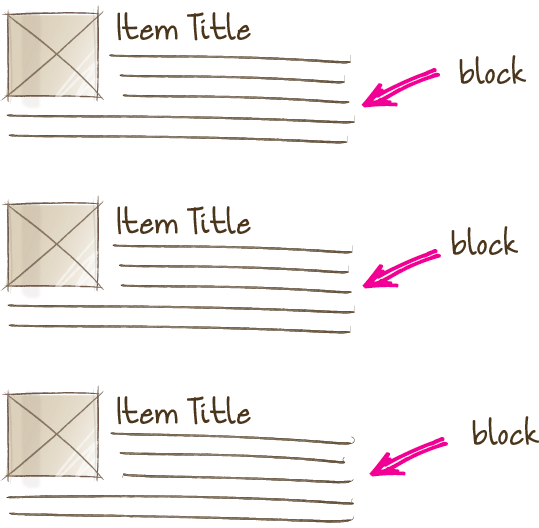
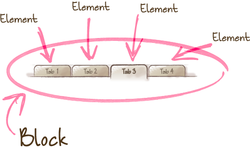
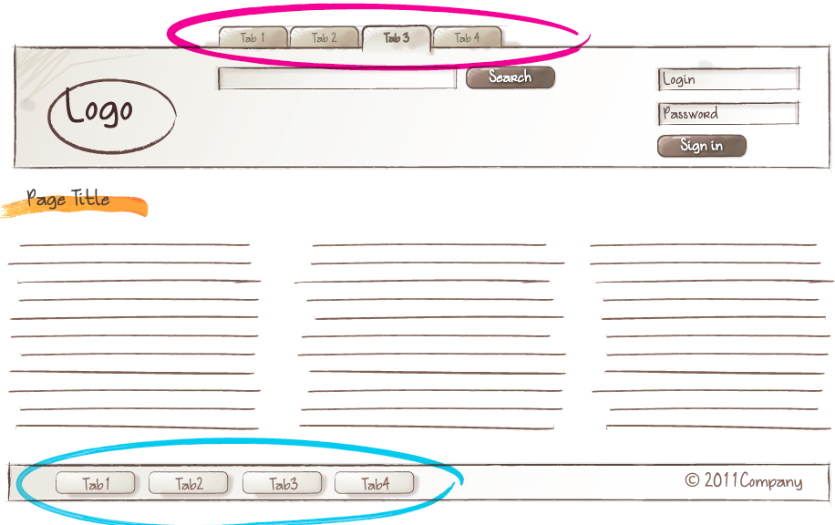

# BEM 공식 문서 정리

## BEM Documentation 을 보고 작성하였습니다.

[[BEM Methodology]](https://en.bem.info/methodology/)

## Block

- Block은 웹 페이지의 구성 요소에 해당하는, 큰 단위의 독립적인 하나의 컴포넌트다.
- Block은 동작 / 템플릿 / 스타일 / 기타 기술적 구현 등을 캡슐화 하고, 독립적으로 재사용이 가능해야 한다.
- "block", 길 경우 "block-long-name"의 작명 규칙

### Block의 특징

- **중첩 가능**
    - Block은 중첩이 여러 레벨로 중첩이 가능하다.

        

        ```jsx
        <!-- `header` block -->
        <header class="header">
            <!-- Nested `logo` block -->
            <div class="logo"></div>

            <!-- Nested `search-form` block -->
            <form class="search-form"></form>
        </header>
        ```

- **유연한 배치**
    - Block은 독립된 하나의 컴포넌트이기 때문에, 위치를 유연하게 이동할 수 있다.
        - 즉 상위의 어떤 block에게 종속적이지 않다.

        

        

- **재사용이 가능**
    - 하나의 block은 여러 갯수 혹은 다양한 곳에서 사용할 수 있다.

        

## Element

- block의 구성 요소가 되고, block과 분리되어 사용할 수 없다.
- element는 사용 목적에 따라 작명되어야 하고, 상태에 따라 작명되어서는 안된다.
    - (목적) 이것은 무엇인가? → item, text, button, form ...
    - (상태) 어떤 타입인가? 어떤 컬러? 있음 없음? → red, big, active, disabled ... (=== modifier)
- "block-name__element-name"의 작명 규칙
    - 더블 언더스코어 (__)로 element임을 알려준다.

### Element의 특징

- **중첩 가능**
    - element(요소)는 서로 중첩이 가능하다.
    - element(요소)에 또 다른 element(요소)를 정의하지 않는다.
        - "block__element1__element2"와 같은 계층 구조를 정의하지 않는다.

            ```jsx
            <!--
                Correct. The structure of the full element name follows the pattern:
                `block-name__element-name`
            -->
            <form class="search-form">
                <div class="search-form__content">
                    <input class="search-form__input">

                    <button class="search-form__button">Search</button>
                </div>
            </form>

            <!--
                Incorrect. The structure of the full element name doesn't follow the pattern:
                `block-name__element-name`
            -->
            <form class="search-form">
                <div class="search-form__content">
                    <!-- Recommended: `search-form__input` or `search-form__content-input` -->
                    <input class="search-form__content__input">

                    <!-- Recommended: `search-form__button` or `search-form__content-button` -->
                    <button class="search-form__content__button">Search</button>
                </div>
            </form>
            ```

- **Block에게 의존적**
    - element(요소)는 항상 block 내에 속하기 때문에 block과 별개로 사용해서는 안된다.

        

        ```jsx
        <!-- Correct. Elements are located inside the `search-form` block -->
        <!-- `search-form` block -->
        <form class="search-form">
            <!-- `input` element in the `search-form` block -->
            <input class="search-form__input">

            <!-- `button` element in the `search-form` block -->
            <button class="search-form__button">Search</button>
        </form>

        <!--
            Incorrect. Elements are located outside of the context of
            the `search-form` block
        -->
        <!-- `search-form` block -->
        <form class="search-form">
        </form>

        <!-- `input` element in the `search-form` block -->
        <input class="search-form__input">

        <!-- `button` element in the `search-form` block-->
        <button class="search-form__button">Search</button>
        ```

- **element와 block의 구분**
    - 범용적?글로벌하게 사용하는 element(요소)는 block으로 사용할 수 있다.

        ```
        jsx
        <!-- `search-form` block -->
        <div class="search-form">
            <!-- `input` block -->
            <input class="input">

            <!-- `button` block -->
            <button class="button">Search</button>
        </div>
        ```

### (?) Block과 Element 의 올바른 사용

- **block**
    - 코드의 어떤 section 혹은 area가 재사용 될 수 있고, 다른 페이지 구성 요소에 의존하지 않는 경우! block으로 작업한다.
- **element**
    - 코드의 어떤 setcion 혹은 area가 상위 block없이는 별도로 사용할 수 없는 경우! element를 사용한다.
    - BEM규칙상 요소에 요소를 이어 작명할수 없기 때문에 (block__ele1__ele1), 새로운 block 단위를 만들어서 쪼개어 단순화 시키도록 한다.

## Modifier

- block 혹은 element(요소)의 기존 모양에서 또 다른 모양이나 상태, 동작을 정의하는 것으로, 필수적 사용은 아니다.
    - 모양 (사이즈 별 / 테마 별 - size_s, theme_island)
    - 상태 (현재와 무엇이 다른가? - disabled, focused....)
    - 행동 (어떻게 행동/위치 하는지? - direciont_left-top)
- "block-name__element-name_modifier-name_modifier-value"의 작명 규칙
    - modifier는 하나의 언더 스코어를 사용한다 (_)
    - 현재 IMA는 더블 하이픈(—)을 사용한다.
        - 예) text-input—disabled

### Modifier의 특징

- modifier는 절대 단독으로 사용할 수 없고, 디폴트의 block이나 element 가 존재해야만 한다.

    

    ```jsx
    <!--
        Correct. The `search-form` block has the `theme` modifier with
        the value `islands`
    -->
    <form class="search-form search-form_theme_islands">
        <input class="search-form__input">

        <button class="search-form__button">Search</button>
    </form>

    <!-- Incorrect. The modified class `search-form` is missing -->
    <form class="search-form_theme_islands">
        <input class="search-form__input">

        <button class="search-form__button">Search</button>
    </form>
    ```

### Modifier의 상태 별 사용 방법

- **Boolean**
    - 해당 element의 있고 없음을 의미 할 때 사용하고, 어떤 테마나 컬러와는 관계가 없다.
    - "block-name_modifier-name" / "block-name__modifier-name_modifier-name" 의 구조

        ```jsx
        <!-- The `search-form` block has the `focused` Boolean modifier -->
        <form class="search-form search-form_focused">
            <input class="search-form__input">

            <!-- The `button` element has the `disabled` Boolean modifier -->
            <button class="search-form__button search-form__button_disabled">Search</button>
        </form>
        ```

- **key - value**
    - 요소의 테마나 컬러와 같은 값을 사용할 때 사용한다. ("menu_theme_islands)
    - "block-name_modifier-name_modifier-value" / "block-name__element-name_modifier-name_modifier-value" 의 구조

        ```jsx
        <!-- The `search-form` block has the `theme` modifier with the value `islands` -->
        <form class="search-form search-form_theme_islands">
            <input class="search-form__input">

            <!-- The `button` element has the `size` modifier with the value `m` -->
            <button class="search-form__button search-form__button_size_m">Search</button>
        </form>

        <!-- You can't use two identical modifiers with different values simultaneously -->
        <form class="search-form
                     search-form_theme_islands
                     search-form_theme_lite">

            <input class="search-form__input">

            <button class="search-form__button
                           search-form__button_size_s
                           search-form__button_size_m">
                Search
            </button>
        </form>
        ```
